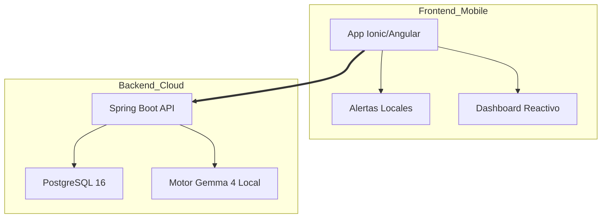

# 🚀 VitalSY: Ecosistema Inteligente para Diabetes Tipo 1 📱💉

VitalSY es una plataforma de grado profesional diseñada para la gestión proactiva de la Diabetes Tipo 1. No es solo una bitácora, es un asistente clínico que utiliza IA causal para analizar tendencias y prevenir riesgos en tiempo real.

## 📌 Tabla de Contenidos
- 📖 Descripción
- 🧠 Innovación: IA Causal y Predictiva
- 🏗️ Arquitectura del Sistema
- ✨ Casos de Uso Implementados
- 🛠️ Stack Tecnológico
- 👨‍💻 Autores

## 📖 Descripción
VitalSY centraliza el control metabólico mediante un enfoque funcional y técnico. El sistema permite:

- Monitoreo Glucémico: Visualización de tendencias en tiempo real.
- Gestión Antropométrica: Seguimiento de peso (progreso desde 147 kg iniciales a 107 kg actuales) y altura (1.81 m).
- Análisis de Riesgo: Motor de IA local para detección de patrones críticos.

## 🧠 Innovación: IA Causal y Predictiva
El corazón de VitalSY es el motor Gemma 4, configurado para análisis de contexto:

- Análisis de Causalidad: Evalúa el flujo de las últimas 3 lecturas para explicar variaciones.
- Intervención Proactiva (C.U. 08): Alertas nativas ante umbrales de Hipoglucemia (< 60 mg/dL) e Hiperglucemia (> 250 mg/dL).

## 🏗️ Arquitectura del Sistema

## ✨ Casos de Uso Implementados
- C.U. 01 - Autenticación: Seguridad con JWT y BCrypt.
- C.U. 02 - Perfil Clínico: Gestión de Ratio IC, Factor de Sensibilidad (ISF) e insulinas (Lispro, Lantus, etc.).
- C.U. 04 - Registro de Glucemia: Entrada validada con respuesta inmediata de riesgo.
- C.U. 05 - Monitoreo (Dashboard): Interfaz táctica con gráficos dinámicos y estética Premium Dark.
- C.U. 09 - Historial Predictivo: Línea de tiempo con análisis de causalidad por IA.

## 🛠️ Stack Tecnológico
- Backend: Java 21, Spring Boot 4, PostgreSQL 16.
- Frontend: Ionic 7, Angular 17, Tailwind CSS.
- IA: Gemma 4 (Ejecución Local).
- Editor: Antigravity.

## 👨‍💻 Autores
- Joaquín Santana.
- Gabriel Hernández.
- Gabriel Nercelles.

