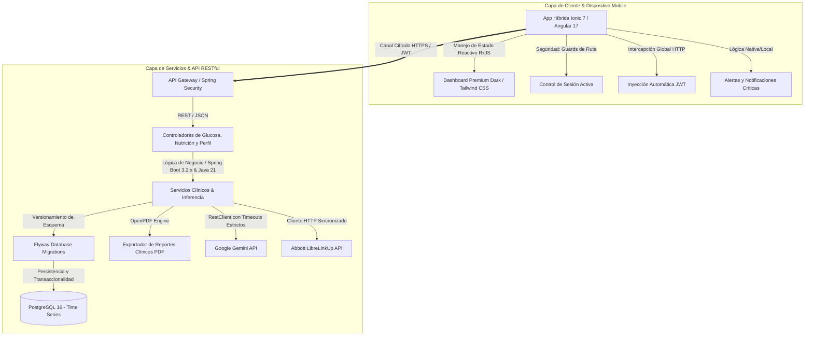

# 🚀 VitalSY: Ecosistema Inteligente para Diabetes Tipo 1 📱💉

VitalSY es una plataforma de grado profesional y arquitectura distribuida diseñada específicamente para el control y la gestión metabólica proactiva de pacientes con Diabetes Mellitus Tipo 1 (DM1). Más allá de actuar como una bitácora tradicional, el sistema funciona como un asistente clínico inteligente que integra sensores continuos de glucosa (CGM), análisis causales mediante modelos de lenguaje de gran tamaño (LLM) y un motor predictivo para la prevención de eventos agudos en tiempo real.

---

## 📌 Tabla de Contenidos
- [📖 Descripción del Proyecto](#-descripción-del-proyecto)
- [🧠 Innovación: IA Causal y Predictiva](#-innovación-ia-causal-y-predictiva)
- [🏗️ Arquitectura del Sistema](#-arquitectura-del-sistema)
- [✨ Casos de Uso Implementados](#-casos-de-uso-implementados)
- [🛠️ Stack Tecnológico](#%EF%B8%8F-stack-tecnológico)
- [🚀 Despliegue Local / Instalación](#-despliegue-local--instalación)
- [👨‍💻 Autores](#-autores)

---

## 📖 Descripción del Proyecto

VitalSY centraliza la gestión metabólica a través de un enfoque clínico, funcional y de alta fidelidad tecnológica. La plataforma ha sido diseñada para optimizar la toma de decisiones terapéuticas diarias mediante:

- **Monitoreo Glucémico en Tiempo Real:** Integración directa con datos de sensores continuos a través de la API de Abbott LibreLinkUp y visualización de tendencias dinámicas.
- **Gestión Clínica y Antropométrica:** Registro y evolución de parámetros corporales (con un caso de uso documentado de descenso ponderal de 147 kg a 107 kg en un paciente de 1.81 m) vinculados a la modulación de la sensibilidad insulínica.
- **Análisis Predictivo Local y Remoto:** Evaluación constante del comportamiento metabólico mediante algoritmos locales e inferencia cognitiva externa.
- **Seguridad y Resiliencia Estrictas:** Mecanismos de comunicación cifrada y fallbacks automáticos ante fallas de red para asegurar la continuidad del servicio médico-asistencial.

---

## 🧠 Innovación: IA Causal y Predictiva

El núcleo diferenciador de VitalSY radica en su **Capa Cognitiva de Análisis Causal**, la cual supera el simple registro de datos históricos mediante el uso de **Google Gemini API** (con configuración de salida estructurada JSON nativa):

1. **Contextualización Clínica Completa:** El sistema recopila de forma anónima y segura los coeficientes metabólicos del paciente: el **Ratio IC** (Relación Insulina-Carbohidratos) y el **ISF** (Factor de Sensibilidad a la Insulina, expresado en mg/dL por unidad), complementados con las notas clínicas de las últimas comidas, ejercicio físico y estados de ánimo.
2. **Gestión Contextual Avanzada:** El motor de IA analiza las lecturas asociándolas al **'Momento'** específico (antes o después de comidas) y a las **'Notas'** o comentarios clínicos provistos por el usuario, proporcionando una evaluación personalizada de las fluctuaciones de glucosa.
3. **Análisis Temporal y Causalidad:** Se procesa el diferencial de tiempo y tendencia de las últimas tres lecturas de glucemia consecutivas para inferir la velocidad de cambio glucémico.
4. **Resiliencia y Sanitización de Respuestas JSON:** Implementa un pipeline robusto de procesamiento de IA que realiza un filtrado y sanitización de las respuestas textuales de la API de Gemini (removiendo metadatos Markdown no deseados o bloques de código adicionales de forma segura) antes de su deserialización en el modelo del dominio. Ante degradación de red o fallos de API externa, se activa un fallback local resiliente que asegura la continuidad del servicio médico.
5. **Intervención Preventiva Temprana (C.U. 08):** Evaluación de riesgos de variabilidad metabólica en una ventana predictiva de 60 a 120 minutos, alertando preventivamente al usuario antes de cruzar los umbrales de seguridad críticos de **Hipoglucemia (< 60 mg/dL)** o **Hiperglucemia (> 250 mg/dL)**.

---

## 🏗️ Arquitectura del Sistema

El ecosistema está construido bajo un patrón desacoplado y orientado a servicios que garantiza alta disponibilidad, modularidad y seguridad en la transferencia de datos clínicos sensibles:


```mermaid
graph TD
    subgraph Frontend [Capa de Cliente & Dispositivo Mobile]
        A[App Híbrida Ionic 7 / Angular 17] -->|Manejo de Estado Reactivo RxJS| B[Dashboard Premium Dark / Tailwind CSS]
        A -->|Seguridad: Guards de Ruta| C[Control de Sesión Activa]
        A -->|Intercepción Global HTTP| D[Inyección Automática JWT]
        A -->|Lógica Nativa/Local| E[Alertas y Notificaciones Críticas]
    end
    
    subgraph Backend [Capa de Servicios & API RESTful]
        F[API Gateway / Spring Security] -->|REST / JSON| G[Controladores de Glucosa, Nutrición y Perfil]
        G -->|Lógica de Negocio / Spring Boot 3.2.x & Java 21| H[Servicios Clínicos & Inferencia]
        H -->|Versionamiento de Esquema| I[Flyway Database Migrations]
        I -->|Persistencia y Transaccionalidad| J[(PostgreSQL 16 - Time Series)]
        H -->|OpenPDF Engine| K[Exportador de Reportes Clínicos PDF]
        H -->|RestClient con Timeouts Estrictos| L[Google Gemini API]
        H -->|Cliente HTTP Sincronizado| M[Abbott LibreLinkUp API]
    end

    A ==>|Canal Cifrado HTTPS / JWT| F
```

---

## ✨ Casos de Uso Implementados

* **C.U. 01 - Autenticación y Autorización de Grado Clínico:** Control de acceso seguro implementado en el backend con Spring Security, contraseñas encriptadas mediante BCrypt y generación de tokens de sesión JWT. En el frontend, la seguridad se gestiona a través de Angular `authGuard` y un interceptor de solicitudes HTTP que adjunta el token JWT de forma transparente.
* **C.U. 02 - Gestión de Perfil Clínico y Parámetros Metabólicos:** Mantenimiento detallado de la altura, peso y coeficientes específicos de control glucémico (**Ratio IC** e **ISF**), permitiendo parametrizar las sugerencias de dosis de insulina rápida (Lispro) y basales (Lantus).
* **C.U. 04 - Registro Glucémico Multi-Origen:** Soporte para ingresos manuales validados por interfaz e ingresos automatizados a través del módulo de sincronización con Abbott LibreLinkUp.
* **C.U. 05 - Dashboard Reactivo de Control Metabólico:** Interfaz táctica optimizada para dispositivos móviles con estética Premium Dark. Muestra el estado del paciente, las lecturas recientes y los gráficos temporales de variabilidad de manera instantánea.
* **C.U. 08 - Motor de Notificación y Alertas Críticas:** Detección en tiempo real de eventos glucémicos severos mediante lógica reactiva en el cliente, gatillando notificaciones visuales y acústicas inmediatas de seguridad.
* **C.U. 09 - Historial Predictivo y Análisis de Causalidad IA:** Panel que renderiza las explicaciones generadas por el motor de IA sobre las oscilaciones glucémicas del paciente, analizando de manera contextual variables críticas como el **'Momento'** y las **'Notas'** cargadas. El sistema sanitiza la respuesta de Gemini y cuenta con un plan de resiliencia (fallback clínico temporal) si se corta la comunicación con la API.
* **C.U. 10 - Exportación de Reportes Clínicos PDF (OpenPDF):** Módulo de generación de PDF profesionales en el backend mediante el motor **OpenPDF**. El documento generado de forma nativa incluye una sección de analítica avanzada que calcula el total de lecturas, el promedio (media) de glucemia y la variabilidad (desviación estándar) de los últimos 30 días, además de una bitácora detallada con coloración condicional para identificar desvíos clínicos de forma ágil por el endocrinólogo.

---

## 🛠️ Stack Tecnológico

### Backend (Cloud Service & Core Clínico)
* **Java 21 (LTS):** Uso de características avanzadas de lenguaje como *Records*, *Pattern Matching* y concurrencia optimizada.
* **Spring Boot 3.2.x:** Framework principal para la inyección de dependencias, configuración automática y creación de la API RESTful.
* **Spring Security & JWT:** Implementación de seguridad y validación de tokens sin estado.
* **Flyway Migrations:** Gestión y versionamiento controlado de la estructura de base de datos relacional.
* **OpenPDF:** Generación programática de reportes y exportación estructurada en formato PDF.

### Frontend (Mobile-First Web Client)
* **Ionic 7 & Angular 17:** Plataforma híbrida y framework modular para lograr una experiencia nativa de alto rendimiento y código altamente mantenible.
* **Tailwind CSS:** Diseño UI/UX moderno, fluido y responsivo con una estética Premium Dark unificada.
* **RxJS:** Programación reactiva basada en observables para la transmisión de flujos de datos asíncronos en tiempo real.

### Persistencia y Servicios Externos
* **PostgreSQL 16:** Motor de base de datos relacional estructurado con índices específicos sobre columnas temporales para optimizar consultas de series de tiempo.
* **Google Gemini API:** Modelo fundacional configurado en modo estricto de generación estructurada (JSON Schema) para auditoría clínica y de causalidad.
* **Abbott LibreLinkUp Client:** Integración HTTP para la recuperación programada y sincronizada de lecturas glucémicas desde la nube del sensor CGM del paciente.

---

## 🚀 Despliegue Local / Instalación

Sigue estos pasos para configurar y ejecutar localmente tanto el backend como el frontend del ecosistema VitalSY.

### Prerrequisitos
Asegúrate de tener instalados los siguientes componentes antes de iniciar:
- **Java Development Kit (JDK) 21**
- **Node.js** (versión 18 o superior) junto con **npm**
- **PostgreSQL 16** (corriendo de forma local o en la nube)
- **Ionic CLI** (opcional, instalable mediante `npm install -g @ionic/cli`)

---

### Paso 1: Configurar y Levantar el Backend (Spring Boot)

1. **Configurar las Variables de Entorno y Base de Datos:**
   Asegúrate de crear una base de datos en PostgreSQL llamada `vitalsy` (o el nombre definido en tu archivo `application.properties`).
   Configura las siguientes variables de entorno o edita el archivo `application.properties` con tus credenciales:
   ```properties
   spring.datasource.url=jdbc:postgresql://localhost:5432/vitalsy
   spring.datasource.username=tu_usuario
   spring.datasource.password=tu_contraseña
   gemini.api.key=tu_api_key_de_google_gemini
   gemini.api.url=https://generativelanguage.googleapis.com/v1beta/models/gemini-1.5-flash:generateContent
   ```

2. **Compilar y Ejecutar el Servidor:**
   Navega al directorio del backend (`Producto/vitalsy-backend`) y ejecuta el comando de Gradle:
   - **En Windows:**
     ```bash
     gradlew.bat bootRun
     ```
   - **En macOS / Linux:**
     ```bash
     ./gradlew bootRun
     ```
   El backend se compilará y las migraciones de Flyway se aplicarán automáticamente. La API estará disponible en `http://localhost:8080`.

---

### Paso 2: Configurar y Levantar el Frontend (Ionic / Angular)

1. **Instalar Dependencias:**
   Navega al directorio del frontend (`Producto/vitalsy-ionic`) y ejecuta:
   ```bash
   npm install
   ```

2. **Levantar el Servidor de Desarrollo Híbrido:**
   Una vez completada la instalación de los paquetes de node, inicia la aplicación mediante el comando:
   ```bash
   npx ionic serve
   ```
   La aplicación móvil se abrirá automáticamente en tu navegador predeterminado en la dirección `http://localhost:8100`.

---

## 👨‍💻 Autores

* **Joaquín Santana**
* **Gabriel Hernández**
* **Gabriel Nercelles**
